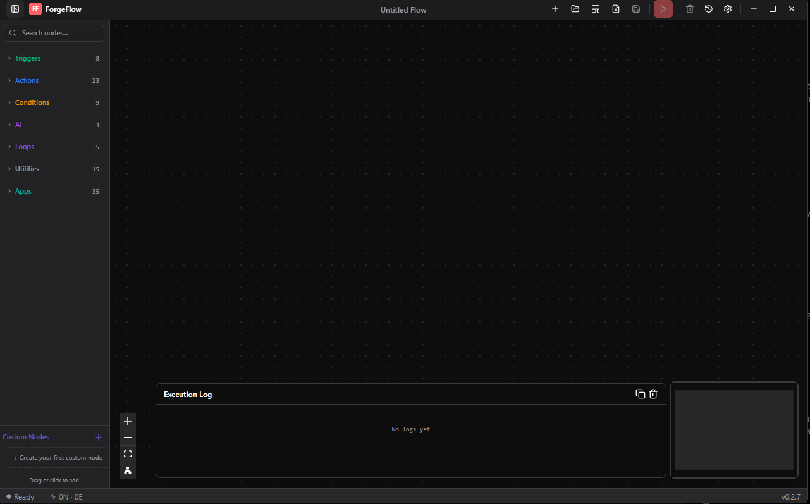

# ForgeFlow

**Local automation. Zero cloud. Full control.**

ForgeFlow is a privacy-first desktop automation engine that lets you build visual automations, run AI-powered actions, and keep your data 100% on-device.

<!--  -->

## ✨ Features

- 🎨 **Visual Automation Builder** - Node-based editor like n8n, with drag & drop
- 🤖 **AI-Native** - First-class AI actions (summarize, classify, extract, generate)
- 🔒 **Privacy-First** - All data stays local, no cloud required
- ⚡ **Fast & Lightweight** - Built with Go + React, minimal resource usage
- 🌙 **Dark Mode** - Beautiful dark UI by default

## 🚀 Quick Start

### Prerequisites

- Go 1.21+
- Node.js 20+
- [Wails CLI](https://wails.io/docs/gettingstarted/installation)

### Development

```bash
# Clone the repo
git clone https://github.com/YOUR_USERNAME/ForgeFlow.git
cd ForgeFlow

# Run in development mode (hot reload)
wails dev
```

### Build

```bash
# Build production binary
wails build
```

The binary will be in `build/bin/`.

### Version Management

To update the app version:

1. Edit `version.json` and change the version number
2. Run `node scripts/sync-version.js`

This automatically updates:
- `wails.json` (productVersion)
- `frontend/package.json` (version)
- `app.go` (version string)
- `build/splash.html` (version display)
- `frontend/src/version.ts` (auto-generated constant for React components)

## 🧩 Node Types

### Triggers
- **File Trigger** - React to file changes
- **Schedule** - Cron or interval-based
- **Webhook** - HTTP receiver
- **Manual** - Button press
- **System** - App/process events

### Actions
- **File Ops** - Move, rename, delete files
- **HTTP Request** - Call external APIs
- **Shell Command** - Run system commands (sandboxed)
- **Notify** - Desktop notifications

### AI Actions
- **Summarize** - AI-powered summaries
- **Classify** - Categorize content
- **Extract** - Pull out entities/data
- **Rewrite** - Transform text
- **Generate** - Create new content
- **Custom Prompt** - Your own AI prompts

## 🛠️ Tech Stack

| Component | Technology |
|-----------|------------|
| Framework | [Wails v2](https://wails.io) |
| Backend | Go 1.21+ |
| Frontend | React 19 + TypeScript 5.8 |
| Styling | Tailwind CSS v4 |
| Build | Vite 7 |
| Node Editor | @xyflow/react v12 |
| State | Zustand |
| Icons | Lucide React |

## 📁 Project Structure

```
ForgeFlow/
├── frontend/           # React frontend
│   ├── src/
│   │   ├── components/ # UI components
│   │   ├── stores/     # Zustand stores
│   │   └── types/      # TypeScript types
├── main.go             # App entry point
├── app.go              # App utilities
├── engine.go           # Execution engine
└── storage.go          # Persistence
```

## 🗺️ Roadmap

### ✅ Completed
- [x] Core execution engine with node-by-node visual feedback
- [x] Visual node-based automation builder (drag & drop + click-to-add)
- [x] Run/Stop workflow execution with real-time status
- [x] Node status indicators (running/success/error with glow effects)
- [x] Node settings panel (right sidebar configuration)
- [x] Custom frameless titlebar with window controls
- [x] Execution history with detailed node-level results
- [x] Import/Export workflows as JSON (with drag-and-drop)
- [x] Auto-layout algorithm for organizing workflows
- [x] MiniMap with category-based coloring
- [x] Local file persistence
- [x] Specialized input fields (cron, hotkey, file picker)
- [x] Dark mode UI
- [x] **HTTP Request** action (GET, POST, PUT, DELETE with headers/body)
- [x] **Shell/Script execution** (run commands with args and working dir)
- [x] **File operations** (read, write, append, copy, move, delete, list, info)
- [x] **Triggers** (manual, schedule/cron, webhook, file watcher, clipboard, hotkey, startup, Telegram)
- [x] **Data utilities** (JSON parse/stringify, regex, math, CSV, date/time)
- [x] **Zip compress/extract**
- [x] **Excel write** support
- [x] **Desktop notifications** (Windows toast notifications)
- [x] **Conditional nodes** (if/else, switch, filter, type check, isEmpty)
- [x] **Loop nodes** (forEach, repeat, while)
- [x] **Error handling** (try/catch node with continueOnError)
- [x] **Variables** with template syntax ({{variable}})
- [x] Flow templates library

### ✅ Recently Added
- [x] **Ollama integration** (local LLM support, auto-detect models)
- [x] **OpenAI/Groq/OpenRouter API** integration
- [x] Background trigger activation (auto-start on app launch)
- [x] **Undo/Redo** (Ctrl+Z / Ctrl+Y) with 50-step history
- [x] **Copy/Paste nodes** (Ctrl+C / Ctrl+V)
- [x] **Community Templates** (fetch & import from GitHub)
- [x] **Custom Node Builder** (create your own nodes with shell/HTTP/JavaScript)

### 📋 Planned
- [ ] System tray with background running
- [ ] Global hotkey listener

## 📄 License

MIT License - see [LICENSE](LICENSE) for details.

---

Built with ❤️ for privacy-conscious automation enthusiasts.
